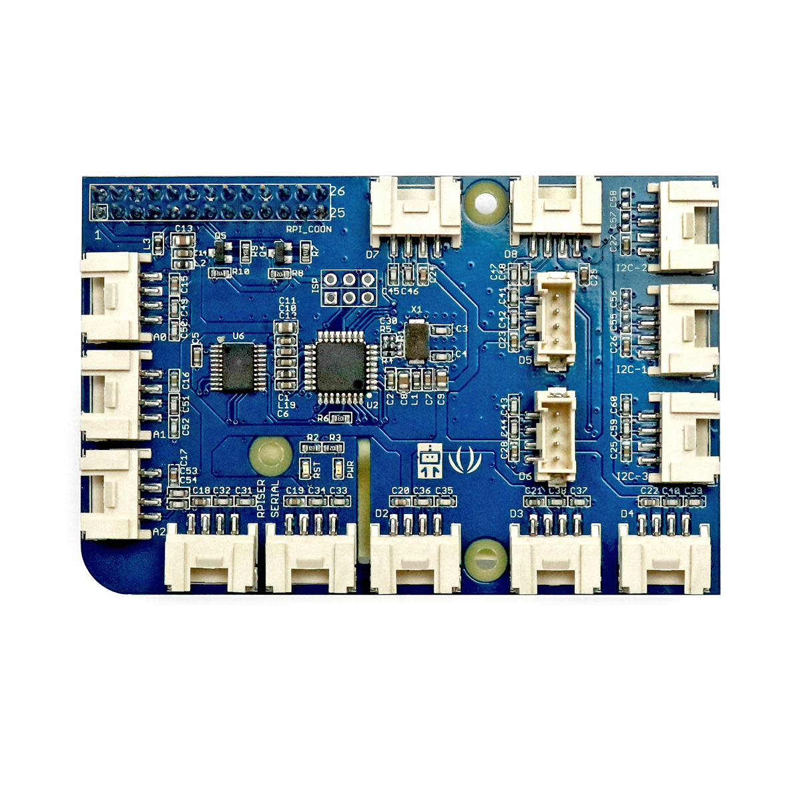

---
title: "Grove-Shield (Raspberry Pi)"
date: "2018-10-01T15:03:37.000Z"
tags: 
  - "shield"
coverImage: "67_grove_shield_raspberrypi.jpg"
material_number: "67"
material_type: "shield"
material_short_descr: "GrovePi+"
manufacture: "Seeed Studio"
manufacture_url: "https://www.seeedstudio.com/"
repo_name: "mks-SeeedStudio-Grove_Pi_Plus"
repo_prefix: "mks"
repo_manufacture: "SeeedStudio"
repo_part: "Grove_Pi_Plus"
product_url: "http://wiki.seeedstudio.com/GrovePi_Plus/"
clone_url: "https://github.com/Make-Your-School/mks-SeeedStudio-Grove_Pi_Plus.git"
embedded_example_file: "examples/Grove_Pi_Plus_minimal/Grove_Pi_Plus_minimal.ino"
---

# Grove-Shield (Raspberry Pi)

## Beschreibung
Das Grove Base Shield ist eine Erweiterungsplatine für Raspberry Pi-ähnliche Einplatinencomputer. Diese Erweiterungsplatinen werden im Allgemeinen als „Shield“ bezeichnet. Sie werden auf den entsprechenden Controller oder Einplatinencomputer gesteckt und vereinfachen so das Anschließen von speziellen Komponenten.

Das abgebildete Shield ist speziell für alle Raspberry Pi-ähnliche Einplatinencomputer entwickelt. Es stellt alle wichtigen \[simple\_tooltip content='Die Mikrocontroller besitzen kleine metallische Kontakte, an die Komponenten, Shields oder andere Platinen angeschlossen werden können. Diese Kontakte werden Pins genannt und können oft als sogenannte GPIO’s (Allzweck Ein- und Ausgabe) eingesetzt werden. Dies bedeutet, dass diese Pins direkt über die Programmierung des Mikrocontrollers angesprochen werden können und hierbei sogar bestimmt werden kann, ob dieser Pin als Eingang (beispielsweise zum Auslesen eines Sensors) oder als Ausgang (beispielsweise zur Steuerung eines Motors) genutzt werden kann. Praktisches Beispiel: Wird am Arduino eine LED an Pin 1 angeschlossen, kann im Programm direkt der Pin 1 als „An“ oder „Aus“ definiert werden und damit die LED an- oder ausgeschaltet werden.'\]Anschlüsse\[/simple\_tooltip\] auf vereinfachten Steckplätzen zur Verfügung, sodass alle weiteren Komponenten, wie Sensoren oder Aktoren, über standardisierte Steckkabel angeschlossen werden können (ohne zu löten). Das Shield stellt so \[simple\_tooltip content='Digital vs. analog:

- Analoge Signale können beliebige kontinuierliche Werte annehmen. Sie verändern sich stufenlos. Dadurch können theoretisch unendlich viele kleine Änderungen (und damit ein unendlicher Informationsinhalt) übertragen werden. Einschränkend wirkt die Genauigkeit, mit der das analoge Signal ausgelesen/erfasst wird.
- Das digitale Signal nimmt nur diskrete Werte an und springt bei einer etwaigen Änderung von einem Wert zum nächsten. Es kann nur eine definierte Anzahl an Informationsinhalten übertragen werden. Vorteilhaft ist dagegen die damit verbundene Fehlerfreiheit bei minimalsten, ungewollten Schwankungen. Oftmals werden nur zwei Werte HIGH und LOW (Ein/Aus oder 1/0) übermittelt.

'\]digitale, analoge\[/simple\_tooltip\] und \[simple\_tooltip content='Bei einer seriellen Datenübertragung werden die Bits (Informationen/Kommandos) nacheinander (seriell) über eine Leitung übertragen. Die wichtigsten seriellen Standards im Rahmen der Mikrocontroller sind I2C (Inter-Integrated Circuit), SPI (Serial Peripheral Interface) und UART (Universal Asynchronous Receiver Transmitter). Die genaue Funktionsweise ist für die reine Nutzung vorerst irrelevant. Es muss allerdings immer geprüft werden an welchen Pins oder an welchen Steckplätzen der jeweilige serielle Anschluss genutzt werden kann. Dies wird in den Datenblättern der Mikrocontroller normalerweise mit angegeben.'\]serielle Anschlüsse\[/simple\_tooltip\] bereit.

Beim Einsatz vom Grove Pi+ Shield können Fehler beim internen Bluetooth des Raspberry Pi's oder Fehler beim Serial Port des Grove Pi auftreten. Falls Bluetooth- oder serielle Schnitstellenprobleme auftreten wird die Verwendung des Raspberry Pi's ohne Grove Shield empfohlen.

Alle weiteren Hintergrundinformationen sowie ein Beispielaufbau und alle notwendigen Programmbibliotheken sind auf dem offiziellen Wiki (bisher nur in englischer Sprache) von Seeed Studio zusammengefasst. Zusätzlich findet man über alle gängigen Suchmaschinen durch die Eingabe der genauen Komponentenbezeichnung entsprechende Projektbeispiele und Tutorials.

<!-- infolist -->

## Wichtige Links für die ersten Schritte:

- [Seeed Studio Wik](http://wiki.seeedstudio.com/GrovePi_Plus/)[i - GrovePi+](http://wiki.seeedstudio.com/GrovePi_Plus/)
- [Dexterindustries - GrovePi+](https://www.dexterindustries.com/GrovePi/get-started-with-the-grovepi/)
- [EXP-Tech Wiki - Grove System](https://www.exp-tech.de/seeed-grove-wiki)

## Projektbeispiele:

- [Seeed Studio Wik](http://wiki.seeedstudio.com/GrovePi_Plus/)[i - GrovePi+](http://wiki.seeedstudio.com/GrovePi_Plus/)
- [Dexterindustries - GrovePi+](https://www.dexterindustries.com/GrovePi/get-started-with-the-grovepi/)

## Weiterführende Hintergrundinformationen:

- [Einplatinencomputer - Wikipedia Artikel](https://de.wikipedia.org/wiki/Einplatinencomputer)
- [Mikrocontroller - Wikipedia Artikel](https://de.wikipedia.org/wiki/Mikrocontroller)
- [GPIO - Wikipedia Artikel](https://de.wikipedia.org/wiki/Allzweckeingabe/-ausgabe)
- [I2C - Wikipedia Artikel](https://de.wikipedia.org/wiki/I%C2%B2C)
- [SPI - Wikipedia Artikel](https://de.wikipedia.org/wiki/Serial_Peripheral_Interface)
- [UART - Wikipedia Artikel](https://de.wikipedia.org/wiki/Universal_Asynchronous_Receiver_Transmitter)

