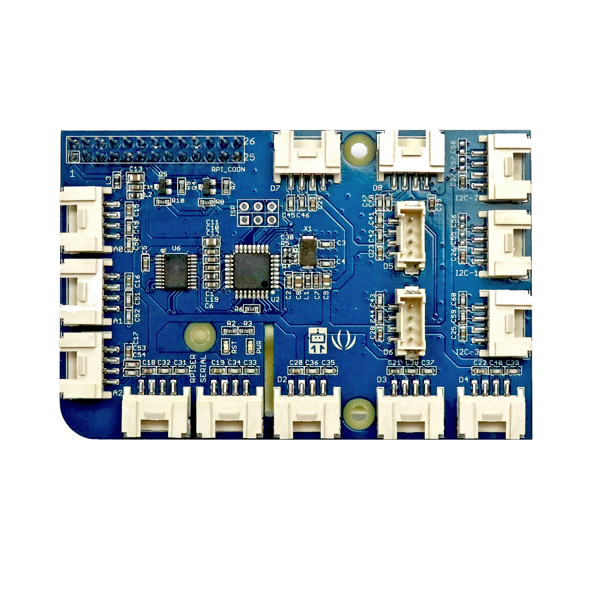

# Grove-Shield (Raspberry Pi)

## Beschreibung
Das Grove Base Shield ist eine Erweiterungsplatine für Raspberry Pi-ähnliche Einplatinencomputer. Diese Erweiterungsplatinen werden im Allgemeinen als „Shield“ bezeichnet. Sie werden auf den entsprechenden Controller oder Einplatinencomputer gesteckt und vereinfachen so das Anschließen von speziellen Komponenten.

Das abgebildete Shield ist speziell für alle Raspberry Pi-ähnliche Einplatinencomputer entwickelt. Es stellt alle wichtigen Anschlüsse auf vereinfachten Steckplätzen zur Verfügung, sodass alle weiteren Komponenten, wie Sensoren oder Aktoren, über standardisierte Steckkabel angeschlossen werden können (ohne zu löten). Das Shield stellt so digitale, analoge und serielle Anschlüsse bereit.

Beim Einsatz vom Grove Pi+ Shield können Fehler beim internen Bluetooth des Raspberry Pi's oder Fehler beim Serial Port des Grove Pi auftreten. Falls Bluetooth- oder serielle Schnitstellenprobleme auftreten wird die Verwendung des Raspberry Pi's ohne Grove Shield empfohlen.

Alle weiteren Hintergrundinformationen sowie ein Beispielaufbau und alle notwendigen Programmbibliotheken sind auf dem offiziellen Wiki (bisher nur in englischer Sprache) von Seeed Studio zusammengefasst. Zusätzlich findet man über alle gängigen Suchmaschinen durch die Eingabe der genauen Komponentenbezeichnung entsprechende Projektbeispiele und Tutorials.

<!-- infolist -->

## Wichtige Links für die ersten Schritte:

- [Seeed Studio Wik](http://wiki.seeedstudio.com/GrovePi_Plus/)[i - GrovePi+](http://wiki.seeedstudio.com/GrovePi_Plus/)
- [Dexterindustries - GrovePi+](https://www.dexterindustries.com/GrovePi/get-started-with-the-grovepi/)
- [EXP-Tech Wiki - Grove System](https://www.exp-tech.de/seeed-grove-wiki)

## Projektbeispiele:

- [Seeed Studio Wik](http://wiki.seeedstudio.com/GrovePi_Plus/)[i - GrovePi+](http://wiki.seeedstudio.com/GrovePi_Plus/)
- [Dexterindustries - GrovePi+](https://www.dexterindustries.com/GrovePi/get-started-with-the-grovepi/)

## Weiterführende Hintergrundinformationen:

- [Einplatinencomputer - Wikipedia Artikel](https://de.wikipedia.org/wiki/Einplatinencomputer)
- [Mikrocontroller - Wikipedia Artikel](https://de.wikipedia.org/wiki/Mikrocontroller)
- [GPIO - Wikipedia Artikel](https://de.wikipedia.org/wiki/Allzweckeingabe/-ausgabe)
- [I2C - Wikipedia Artikel](https://de.wikipedia.org/wiki/I%C2%B2C)
- [SPI - Wikipedia Artikel](https://de.wikipedia.org/wiki/Serial_Peripheral_Interface)
- [UART - Wikipedia Artikel](https://de.wikipedia.org/wiki/Universal_Asynchronous_Receiver_Transmitter)

